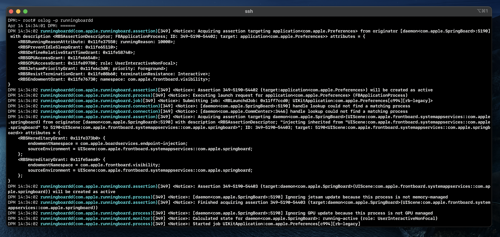

## Note:
this is a fork of the original project created by limneos, in this version I’ve adjusted and added the following features:

 1. Color integration
 2. Updated the entitlements to support a wider range API’s
 3. Updated the project’s build hierarchy to be compatible with modern versions of Theos + very minor adjustments to the code to improve all around usability (date view, usage, etc.)

## Example output:

# oslog
os_log command line tool implementation for iOS

A tool that shows os_log stream info/activity directly on iOS devices

usage:

	oslog [—info|—debug] [ -p pid ] [—noLevelInfo] [—noSubsystemInfo]

	Examples:
		oslog 
		oslog —debug
		oslog -p SpringBoard

